# Dynamic Mixture-of-Experts for Visual Autoregressive Model [](https://arxiv.org/abs/2510.08629)

<table align="center" width="100%">
  <tr>
    <td align="center" width="50%">
      <strong>DMoE-VAR</strong>
    </td>
    <td align="center" width="50%">
      <strong>VAR</strong>
    </td>
  </tr>
  <tr>
    <td align="center" width="50%">
      
      
      
    </td>
    <td align="center" width="50%">
      
      
      
    </td>
  </tr>
  <tr>
    <td align="center" width="50%">
      
      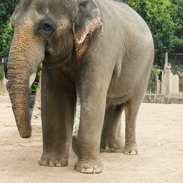
      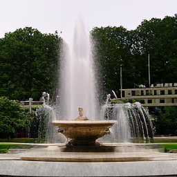
    </td>
    <td align="center" width="50%">
      
      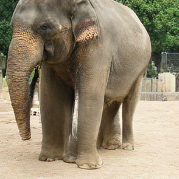
      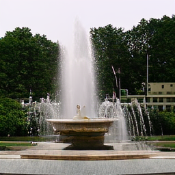
    </td>
  </tr>
  <tr>
    <td align="center" width="50%">
      
      
      
    </td>
    <td align="center" width="50%">
      
      
      
    </td>
  </tr>
</table>


## Related Works

- **Exploiting Activation Sparsity with Dense to Dynamic-k Mixture-of-Experts Conversion (D2DMoE)**  
  [](https://arxiv.org/abs/2310.04361)
  [](https://github.com/bartwojcik/D2DMoE)
- **Visual Autoregressive Modeling: Scalable Image Generation via Next-Scale Prediction (VAR)**  
  [](https://arxiv.org/abs/2404.02905)
  [](https://github.com/FoundationVision/VAR)
- **MoEfication: Transformer Feed-forward Layers are Mixtures of Experts**  
  [](https://arxiv.org/abs/2110.01786)
  [](https://github.com/thunlp/MoEfication)

## What's new

The paper proposes a dynamic MoE router for VAR that reduces redundant compute during autoregressive generation at later scales. To achieve this we train a lightweight routers and apply dynamic, scale-aware thresholding to trade quality for compute. This results in ~20% fewer FLOPs and ~11% faster inference while matching dense baseline quality.

<table align="center" width="100%">
  <tr>
    <td align="center" width="33.33%"><strong>Scale 8</strong></td>
    <td align="center" width="33.33%"><strong>Scale 9</strong></td>
    <td align="center" width="33.33%"><strong>Scale 10</strong></td>
  </tr>
  <tr>
    <td align="center" width="33.33%">
      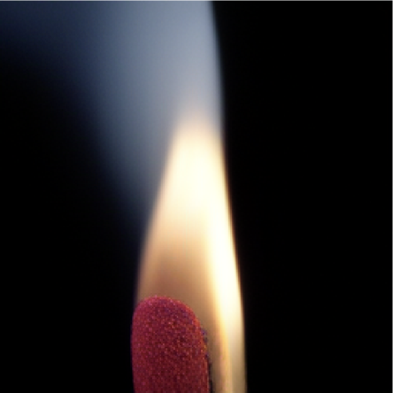
      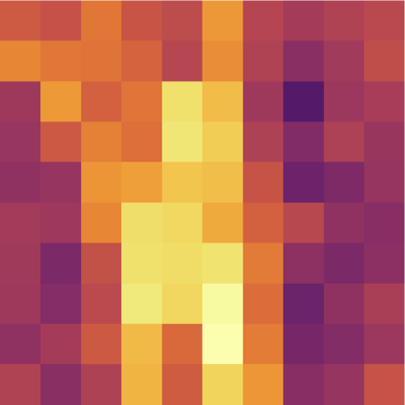
    </td>
    <td align="center" width="33.33%">
      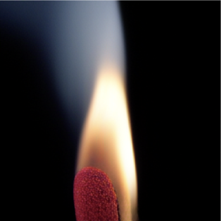
      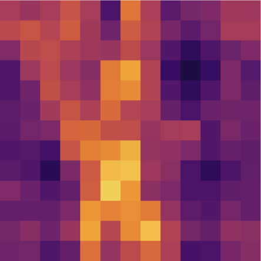
    </td>
    <td align="center" width="33.33%">
      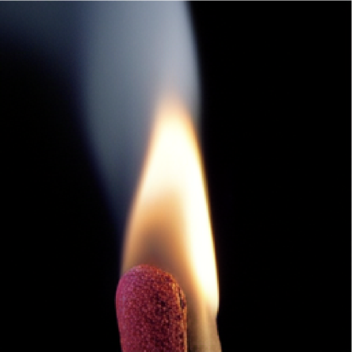
      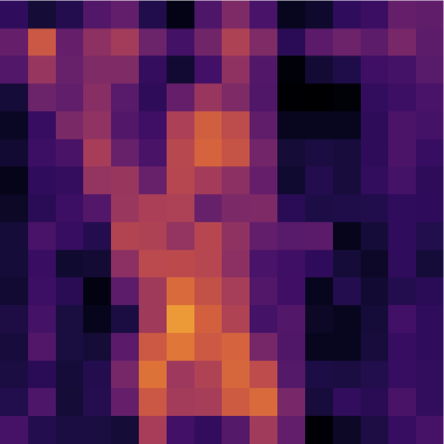
    </td>
  </tr>
  <tr>
    <td align="center" width="33.33%">
      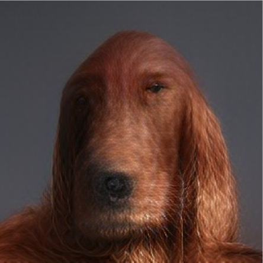
      
    </td>
    <td align="center" width="33.33%">
      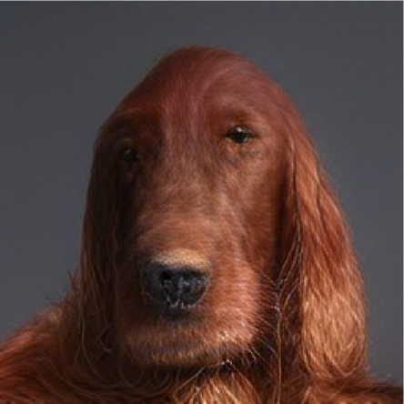
      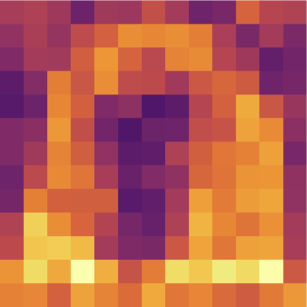
    </td>
    <td align="center" width="33.33%">
      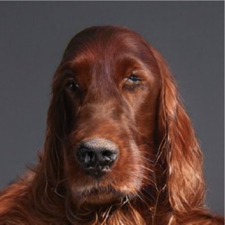
      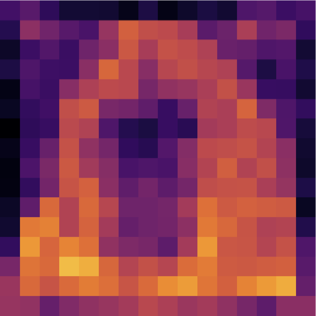
    </td>
  </tr>
</table>


<p align="center"><em>At each scale (8, 9, and 10), the generated image (left) is paired with its corresponding expert allocation map (right), obtained by summing the activated experts per token (darker=less experts used).</em></p>

## Repository Structure
- `architectures/`: VAR, VQVAE, MoE layers, and model building code.
- `methods/dynamic_sparsification/`: training/eval logic (expert split, sparse fine-tuning, router training, FID/FLOPs/timing).
- `scripts/`: experiment launchers (mostly Submitit/SLURM jobs).
- `utils_var/`: VAR-style distributed/data/training utilities.
- `train.py`, `trainer.py`, `eval.py`: core train/eval loops.

## Setup
### 1) Environment
```bash
conda env create -f environment.yml
conda activate effbench_env
```


### 2) Configure paths (`user.env`)
Edit `user.env` and set:

- `RUNS_DIR`, `RESULTS_DIR`, `LOGS_DIR`
- dataset paths (`TINYIMAGENET_PATH`, `IMAGENET_PATH`, ...)
- optional W&B variables

## VAR Dependency and Where It Is Imported
This repo already contains VAR model code under `architectures/` and `utils_var/`, but it still relies on VAR checkpoints.

Main import/entry points:

- `architectures/__init__.py`: exports `VAR`, `VQVAE`, `build_vae_var`
- `architectures/pretrained.py`: `get_var_d16(var_d=...)`
- Used by most methods: `from architectures.pretrained import get_var_d16`

Example:
```python
from architectures.pretrained import get_var_d16
var_model, vae_model = get_var_d16(var_d=16)
```

`get_var_d16()` will download if missing:

- `vae_ch160v4096z32.pth`
- `var_d{depth}.pth`

from `https://huggingface.co/FoundationVision/var/resolve/main`.

## Data Format
Data loader expects ImageNet-style directory layout:

```text
<data_path>/
  train/<class_name>/*.JPEG
  val/<class_name>/*.JPEG
```

The actual loader uses `args.data_path` (from `utils_var/arg_util.py`), not `args.dataset`.

## How To Run
Most experiments are launched via:

```bash
python scripts/<script_name>.py
```

These scripts submit jobs with SLURM and are intended to replicate the experiment templates described in the paper.

### Typical pipeline used in this repo
1. Prepare dense/fine-tuned VAR checkpoints (`path_file_ft`).
2. Apply ReLU activation to FFN layers:
   - `scripts/d2dmoe_var_relu_ft.py`
3. Convert dense FFNs to MoE experts:
   - `scripts/d2dmoe_var_moe_relu.py`
4. Train routers on top of MoE model:
   - `scripts/d2dmoe_var_baseline.py`
5. Evaluate:
   - FID / sampling: `scripts/d2dmoe_var_layer_switch.py`, `scripts/d2dmoe_var_plot_sample.py`, `scripts/d2dmoe_var_baseline_fid.py`
   - FLOPs: `scripts/d2dmoe_var_count_flops.py`
   - Latency profiling: `scripts/d2dmoe_var_time_experts.py`
   - Pruning baseline: `scripts/d2dmoe_var_pruning.py`

## Required Checkpoint Paths in Scripts
You must edit these fields in the script you run:

- `path_file` or `path_file_ft`: dense/sparse FT VAR checkpoint (often `ar-ckpt-...pth`)
- `path_file_moe`: MoE converted checkpoint (`.../final.pth`)
- `path_file_router`: trained router checkpoint (`.../final.pth`)
- `final_path_save`: output folder tag
- `var_d`: VAR depth (e.g., `16`, `20`)

## Outputs
Common output locations:

- model checkpoints: under `RUNS_DIR` (`final.pth` files)
- logs: `LOGS_DIR` and `local_output/`
- sampled images and diagnostics: `Images/`, `data/`, `CUDA_Profile_tensorboard/`

## Notes
- FID scripts expect `adm_in256_stats.npz` available using [torch-fidelity](https://github.com/toshas/torch-fidelity).
- Run names are hash-based (`generate_run_name`) and may differ from folder tags used by some scripts.
- This codebase mixes D2DMoE and VAR codebases; verify `path_file_*`, `data_path`, and script comments before large runs.

## Tip

While it is possible to run the Relufication and Hoyer sparsification in this codebase it is advised to directly implement it in the [VAR](https://github.com/FoundationVision/VAR) repository. You would need to replace the GeLU with a ReLU activation function in **their** `models/basic_var.py` (optionally add the hoyer sparsification loss to the training loop) then finetune the depth 16 model. You can then import the model in this code base and continue with the MoEfication stage in `scripts/d2dmoe_var_moe_relu.py`.
